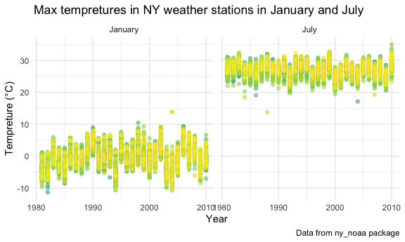

p8105\_hw3\_cl4044
================
Chenxi Liu
10/6/2020

## Problem 1

``` r
data("instacart")
```

This dataset contains 1384617 rows and 15 columns.

Observations are the level of items in orders by user. There are user /
order variables – user ID, order ID, order day, and order hour. There
are also item variables – name, aisle, department, and some numeric
codes.

How many aisles, and which are most items from?

There are 0 aisles. Fresh Vegetables are the most items from.

``` r
instacart %>% 
    count(aisle) %>% 
    filter(n > 10000) %>% 
    mutate(
        aisle = factor(aisle),
        aisle = fct_reorder(aisle, n)
    ) %>% 
    ggplot(aes(x = aisle, y = n)) + 
    geom_point() + 
    theme(axis.text.x = element_text(angle = 90, vjust = 0.5, hjust = 1))
```


Let’s make a table\!\!

``` r
instacart %>% 
    filter(aisle %in% c("baking ingredients", "dog food care", "packaged vegetables fruits")) %>% 
    group_by(aisle) %>% 
    count(product_name) %>% 
    mutate(rank = min_rank(desc(n))) %>% 
    filter(rank < 4) %>% 
    arrange(aisle, rank) %>% 
    knitr::kable()
```

| aisle                      | product\_name                                 |    n | rank |
| :------------------------- | :-------------------------------------------- | ---: | ---: |
| baking ingredients         | Light Brown Sugar                             |  499 |    1 |
| baking ingredients         | Pure Baking Soda                              |  387 |    2 |
| baking ingredients         | Cane Sugar                                    |  336 |    3 |
| dog food care              | Snack Sticks Chicken & Rice Recipe Dog Treats |   30 |    1 |
| dog food care              | Organix Chicken & Brown Rice Recipe           |   28 |    2 |
| dog food care              | Small Dog Biscuits                            |   26 |    3 |
| packaged vegetables fruits | Organic Baby Spinach                          | 9784 |    1 |
| packaged vegetables fruits | Organic Raspberries                           | 5546 |    2 |
| packaged vegetables fruits | Organic Blueberries                           | 4966 |    3 |

Apples vs ice cream..

``` r
instacart %>% 
    filter(product_name %in% c("Pink Lady Apples", "Coffee Ice Cream")) %>% 
    group_by(product_name, order_dow) %>% 
    summarize(mean_hour = mean(order_hour_of_day)) %>% 
    pivot_wider(
        names_from = order_dow,
        values_from = mean_hour
    )
```

    ## `summarise()` regrouping output by 'product_name' (override with `.groups` argument)

    ## # A tibble: 2 x 8
    ## # Groups:   product_name [2]
    ##   product_name       `0`   `1`   `2`   `3`   `4`   `5`   `6`
    ##   <chr>            <dbl> <dbl> <dbl> <dbl> <dbl> <dbl> <dbl>
    ## 1 Coffee Ice Cream  13.8  14.3  15.4  15.3  15.2  12.3  13.8
    ## 2 Pink Lady Apples  13.4  11.4  11.7  14.2  11.6  12.8  11.9

## Problem 2

Load, tidy, and wrangle the data.

``` r
accel_df = read_csv("./data/accel_data.csv") %>%
  janitor::clean_names() %>%
  pivot_longer(cols = starts_with("activity"), 
               names_to = "minute", 
               names_prefix = "activity_", 
               values_to = "activity_count"
               ) %>%
  mutate(weekend = if_else(day %in% c("Saturday", "Sunday"), TRUE, FALSE)) %>%
  mutate(day = as.factor(day),
         minute = as.numeric(minute),
         week = as.integer(week),
         day_id = as.integer(day_id)
         )
```

    ## Parsed with column specification:
    ## cols(
    ##   .default = col_double(),
    ##   day = col_character()
    ## )

    ## See spec(...) for full column specifications.

``` r
accel_df
```

    ## # A tibble: 50,400 x 6
    ##     week day_id day    minute activity_count weekend
    ##    <int>  <int> <fct>   <dbl>          <dbl> <lgl>  
    ##  1     1      1 Friday      1           88.4 FALSE  
    ##  2     1      1 Friday      2           82.2 FALSE  
    ##  3     1      1 Friday      3           64.4 FALSE  
    ##  4     1      1 Friday      4           70.0 FALSE  
    ##  5     1      1 Friday      5           75.0 FALSE  
    ##  6     1      1 Friday      6           66.3 FALSE  
    ##  7     1      1 Friday      7           53.8 FALSE  
    ##  8     1      1 Friday      8           47.8 FALSE  
    ##  9     1      1 Friday      9           55.5 FALSE  
    ## 10     1      1 Friday     10           43.0 FALSE  
    ## # … with 50,390 more rows

This dataset has 50400 observations. The dataset contains 6 variables:  
`week`: the week of the obeservation, a integer variable ranging from 1
to 5.  
`day_id`: the unique id of the day of the observation, a integer varible
ranging from 1 to 35  
`day`: the name of the day of the week, a factor variable from Monday to
Sunday.  
`activity_count`: per-minute activity counts, a double variable ranging
from 1 to 8982.  
`weekend`: a logical variable indicates whether the day is a day of
observation is a weekend.

create a table showing the aggregation accross minutes to create a total
activity variable for each day

``` r
table_df =
  accel_df %>% 
  group_by(week, day) %>% 
  summarize(day_activity_sum = sum(activity_count)) %>%
  pivot_wider(
      id_cols = "week",
      names_from = "day",
      values_from = "day_activity_sum"
    ) %>%
  select(week, Monday, Tuesday, Wednesday, Thursday, Friday, Saturday, Sunday) %>%
  knitr::kable(caption = "Aggregated activity counts by day and week")
```

    ## `summarise()` regrouping output by 'week' (override with `.groups` argument)

``` r
table_df
```

| week |    Monday |  Tuesday | Wednesday | Thursday |   Friday | Saturday | Sunday |
| ---: | --------: | -------: | --------: | -------: | -------: | -------: | -----: |
|    1 |  78828.07 | 307094.2 |    340115 | 355923.6 | 480542.6 |   376254 | 631105 |
|    2 | 295431.00 | 423245.0 |    440962 | 474048.0 | 568839.0 |   607175 | 422018 |
|    3 | 685910.00 | 381507.0 |    468869 | 371230.0 | 467420.0 |   382928 | 467052 |
|    4 | 409450.00 | 319568.0 |    434460 | 340291.0 | 154049.0 |     1440 | 260617 |
|    5 | 389080.00 | 367824.0 |    445366 | 549658.0 | 620860.0 |     1440 | 138421 |

Aggregated activity counts by day and week

The weekday activities counts are fairly consistant throughout the week.
From week 1 to week 3, the activity counts on weekends are slightly
lower than that of on weekdays. However, form week 4 to week 5, the
activity counts on weekends are much lower than that of on weekdays.

``` r
accel_df %>%
  group_by(day, minute) %>% 
  summarize(activity_sum = sum(activity_count)) %>% 
  ggplot(aes(x = minute ,y = activity_sum, color = day)) + 
  geom_point(alpha = .2, size = 0.5) +
  geom_smooth(size = 0.8) + 
  theme(legend.position = "bottom") +
  labs(
    title = "24-hour Activity Time Courses Across Each Day",
    x = "Hours",
    y = "Activity Counts",
    caption = "Accelerometer data collected on a 63 year-old male with BMI 25",
    color = "Day of the week") +
  scale_x_continuous(
    breaks = c(seq(0, 1440, by = 60)),
    labels = c(seq(0, 24, by = 1))
  )
```

    ## `summarise()` regrouping output by 'day' (override with `.groups` argument)

    ## `geom_smooth()` using method = 'gam' and formula 'y ~ s(x, bs = "cs")'


From the graph above, I observed that this person usually sleep from
23PM to 5AM everyday because the activity counts during these hours are
relatively low. This person also usually has the highest activity count
on Friday nights.

## Problem 3

``` r
data("ny_noaa")
ny_df = ny_noaa %>%
  separate(date, into = c("year","month","day"),sep = "-") %>% 
  mutate(
    year = as.integer(year),
    month = as.integer(month),
    month = (month.name[month]),
    day = as.integer(day),
    prcp = as.double(prcp),
    prcp = prcp / 10,
    tmax = as.numeric(tmax),
    tmin = as.numeric(tmin),
    tmax = tmax / 10,
    tmin = tmin / 10
  ) 
ny_df %>%
  group_by(snow) %>%
  drop_na(snow) %>%
  summarize(count = n()) %>%
  arrange(desc(count))
```

    ## `summarise()` ungrouping output (override with `.groups` argument)

    ## # A tibble: 281 x 2
    ##     snow   count
    ##    <int>   <int>
    ##  1     0 2008508
    ##  2    25   31022
    ##  3    13   23095
    ##  4    51   18274
    ##  5    76   10173
    ##  6     8    9962
    ##  7     5    9748
    ##  8    38    9197
    ##  9     3    8790
    ## 10   102    6552
    ## # … with 271 more rows

For snowfall, the top five most commonly observed snowfall values are 0,
25, 13, 51 and 76. Since there is no snow most of days in a year, 0
should be the most commonly observed snowfall value.

``` r
ny_df %>%
  filter(month == c("January", "July")) %>%
  group_by(id, year, month) %>%
  summarize(mean_max = mean(tmax, na.rm = TRUE)) %>%
  ggplot(aes(x = year, y = mean_max)) +
  geom_point(aes(color = id, alpha = 0.01))+ 
    labs(
    title = "Max tempretures in NY weather stations in January and July", 
    y = "Tempreture (°C)", 
    x = "Year",
    caption = "Data from ny_noaa package") +
  theme(legend.position = "none") +
  facet_grid(.~month)
```

    ## `summarise()` regrouping output by 'id', 'year' (override with `.groups` argument)

    ## Warning: Removed 5972 rows containing missing values (geom_point).



Most of the station’s average max temperature are between -10°C and 10°C
in January; between 20°C and 35°C in July. The temperatures in January
varies more than that in July. There are also a few outliers observed.

``` r
tmax_tmin_plot =
  ny_df %>%
  ggplot(aes(x = tmax, y = tmin)) +
  geom_hex() +
    labs(
    title = "Max vs. Min Temperatures in NY",
    x = "Max Temperature (°C)",
    y = "Min Temperature (°C)",
    caption = "Data from ny_noaa package"
  ) +
  theme(legend.position = "right")
```

``` r
snowfall_plot = 
  ny_df %>%
  drop_na() %>% 
  filter(snow > 0 & snow < 100) %>%
  ggplot(aes(x = year, y = snow, group = year, fill = year)) +
  geom_violin() +
  stat_summary(mult=1, geom="pointrange", size = 0.1, color="red")
```

    ## Warning: Ignoring unknown parameters: mult

``` r
    labs(
    title = "Distribution of Snowfall(mm)",
    x = "Year",
    y = "Snowfall (mm)",
    caption = "Data from ny_noaa package"
  ) +
  scale_x_continuous(
    breaks = c(seq(1980, 2010, by = 5))
  ) +
  theme(legend.position = "none")
```

    ## NULL

Two-panel plot using patchwork

``` r
tmax_tmin_plot + snowfall_plot
```

    ## Warning: Removed 1136276 rows containing non-finite values (stat_binhex).

    ## No summary function supplied, defaulting to `mean_se()`


In the Max vs. Min Temperatures in NY plot, the observations are mostly
clustered on two spot, the (28, 14) and (10,0) cluster. Most of
observations are found in the greenish hexes, all the purple hexes means
the number observation is small (\<10000). In the Snowfall Distribution
plot, we can observe that the snowfall distributions across years looks
similar to each other. So the snowfall each year is pretty consistent
with an averafe of snowfall around 30mm.

The `ny_df` dataset has 2595176 rows and 9 columns. After tidying the
original dataset, the `ny_df` dataframe contains `9` variables:  
`id`: Weather station ID, a character variable.  
`year`: Year of observation, an integer variable, ranging from 1981 to
2010.  
`month`: The month of observation, a character variable.  
`day`: The day of observation, an integer variable, ranging from 1 to
31.  
`prcp`: Precipitation (mm), a double variable, ranging from 0 to 2286.  
`snow`: Snowfall (mm), an integer variable, ranging from -13 to 10160.  
`snwd`: Snow depth (mm), an integer variable, ranging from 0 to 9195.  
`tmax`: Maximum temperature (C), a double variable, ranging from -38.9
to 60.  
`tmin`: Minimum temperature (C), a double variable, ranging from -59.4
to 60.

There is 3387623 counts of null value in `ny_df`.  
The total null values in each columns:

``` r
colSums(is.na(ny_df))
```

    ##      id    year   month     day    prcp    snow    snwd    tmax    tmin 
    ##       0       0       0       0  145838  381221  591786 1134358 1134420

Since our data frame is so large(2595176 X 9), the 3387623 counts of
null value does not matter very much. Our plots ignored these null
values anyway.
